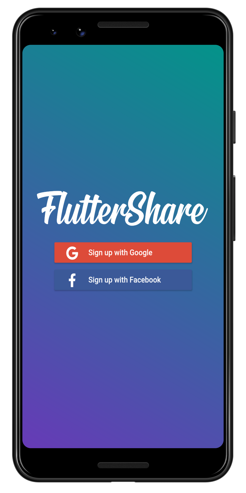
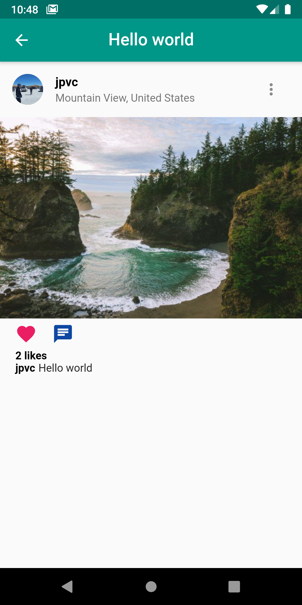
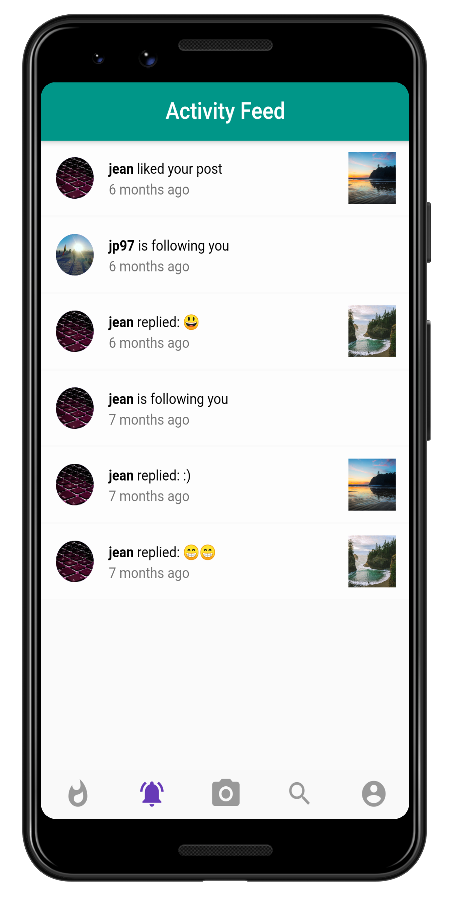
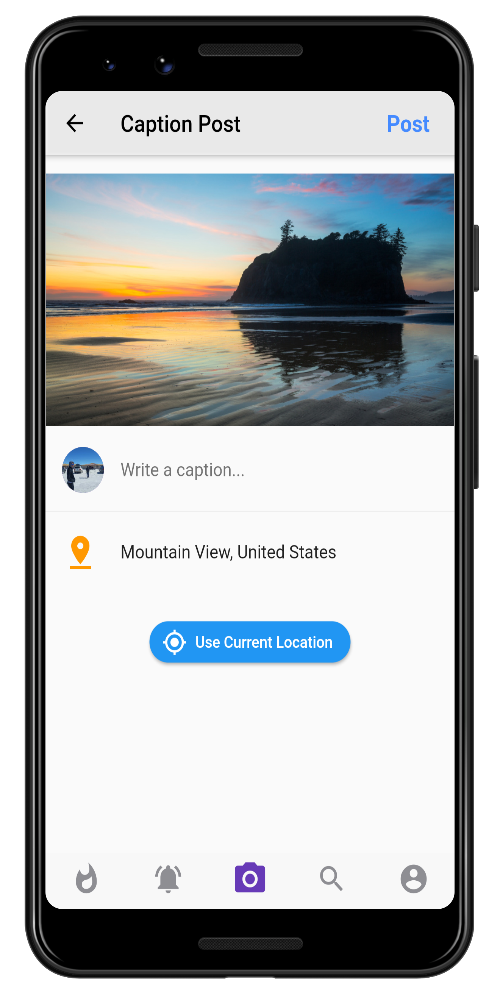

  

<h3 align="center">FlutterShare</h3>

   
  
  
  

---

      
    
    
    

 Social network app created using Flutter and Firebase as Backend.
      

## 🏁 Getting Started

This project is a starting point for a Flutter application.

A few resources to get you started if this is your first Flutter project:

- [Lab: Write your first Flutter app](https://flutter.dev/docs/get-started/codelab)
- [Cookbook: Useful Flutter samples](https://flutter.dev/docs/cookbook)

For help getting started with Flutter, view our
[online documentation](https://flutter.dev/docs), which offers tutorials,
samples, guidance on mobile development, and a full API reference.

## ⛏️ Built Using 
- [Flutter](https://flutter.dev/) - open-source mobile UI framework
- [Firebase](https://firebase.google.com/) -  Backend-as-a-Service — BaaS 
